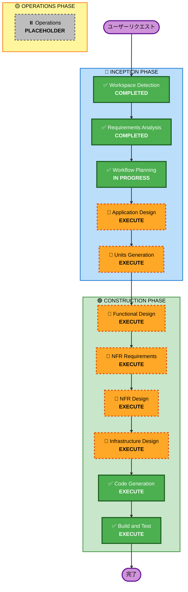

# 実行計画 - ドボンゲーム

## 詳細分析サマリー

### プロジェクト特性
- **プロジェクトタイプ**: Greenfield（新規開発）
- **スコープ**: 中規模
- **複雑度**: 中程度
- **開発期間**: 1-2週間（MVP）
- **ユーザー規模**: 小規模（5-10人）

### 変更影響評価

#### ユーザー向け変更
- ✅ **あり**: 新しいゲームシステムの提供

#### 構造的変更
- ✅ **あり**: 新規システムの構築（バックエンド + フロントエンド）

#### データモデル変更
- ✅ **あり**: ユーザー、ゲーム、ゲーム履歴、統計情報のデータモデル

#### API変更
- ✅ **あり**: ゲームロジック、ユーザー管理、統計情報のAPI

#### NFR影響
- ✅ **あり**: リアルタイム通信（WebSocket）、安定性重視

### リスク評価
- **リスクレベル**: 中程度
- **ロールバック複雑度**: 低い（新規開発のため）
- **テスト複雑度**: 中程度（複雑なゲームロジック）

---

## ワークフロー可視化

**凡例**:
- 🟢 **COMPLETED**: 完了済み
- 🟠 **EXECUTE**: 実行予定
- 🔘 **SKIP**: スキップ
- ⏸️ **PLACEHOLDER**: 将来の拡張

---

## 実行フェーズ

### 🔵 INCEPTION PHASE

- [x] **Workspace Detection** - COMPLETED
  - ワークスペスは空の状態を確認
  
- [x] **Requirements Analysis** - COMPLETED
  - ゲームルール、機能要件、非機能要件を詳細に分析
  - ドボン宣言の複雑なロジック、倍率システムを理解
  
- [x] **Workflow Planning** - IN PROGRESS
  - 実行フェーズを決定中

- [ ] **Application Design** - EXECUTE
  - **理由**: 新規システムの構築のため、コンポーネント設計が必要
  - **内容**: 
    - バックエンド: ゲームロジック、ユーザー管理、統計情報のコンポーネント設計
    - フロントエンド: ゲーム画面、ロビー、プロフィール、統計画面のコンポーネント設計
    - リアルタイム通信: WebSocket通信の設計

- [ ] **Units Generation** - EXECUTE
  - **理由**: 複数のコンポーネント・サービスが必要なため、ユニット分割が必要
  - **内容**:
    - Unit 1: バックエンド（ゲームロジック、ユーザー管理、統計情報）
    - Unit 2: フロントエンド（ゲーム画面、ロビー、プロフィール、統計画面）

### 🟢 CONSTRUCTION PHASE

- [ ] **Functional Design** - EXECUTE
  - **理由**: 複雑なゲームロジック（ドボン宣言、倍率計算、山札管理）の詳細設計が必要
  - **内容**:
    - ゲーム状態管理の詳細設計
    - ドボン宣言ロジックの詳細設計
    - 倍率計算ロジックの詳細設計
    - 山札管理ロジックの詳細設計

- [ ] **NFR Requirements** - EXECUTE
  - **理由**: リアルタイム通信、安定性、セキュリティなどの非機能要件が重要
  - **内容**:
    - リアルタイム通信の要件（WebSocket、遅延許容度）
    - 安定性要件（接続復帰、エラーハンドリング）
    - セキュリティ要件（認証、通信暗号化）
    - パフォーマンス要件（レスポンス時間）

- [ ] **NFR Design** - EXECUTE
  - **理由**: NFR要件を実装するための設計が必要
  - **内容**:
    - WebSocket通信の設計
    - エラーハンドリング・リトライロジックの設計
    - 認証・認可の設計
    - ロードバランシング・スケーリングの設計

- [ ] **Infrastructure Design** - EXECUTE
  - **理由**: デプロイ環境、データベース、リアルタイム通信インフラの設計が必要
  - **内容**:
    - バックエンドサーバー（Node.js）のデプロイ設計
    - フロントエンド（Vue.js）のデプロイ設計
    - データベース（PostgreSQL/MongoDB）の設計
    - WebSocket通信インフラの設計
    - ローカル開発環境の構築

- [ ] **Code Generation** - EXECUTE (ALWAYS)
  - **理由**: 実装コード生成が必須
  - **内容**:
    - バックエンド実装（ゲームロジック、API、データベース）
    - フロントエンド実装（UI/UX、状態管理、通信）
    - テストコード生成

- [ ] **Build and Test** - EXECUTE (ALWAYS)
  - **理由**: ビルド、テスト、検証が必須
  - **内容**:
    - ビルド手順書作成
    - ユニットテスト実行手順
    - 統合テスト実行手順
    - パフォーマンステスト実行手順

### 🟡 OPERATIONS PHASE

- [ ] **Operations** - PLACEHOLDER
  - **理由**: 将来のデプロイ・監視ワークフロー用に予約

---

## 実行フェーズの詳細

### 実行するフェーズ（8フェーズ）

#### INCEPTION PHASE（3フェーズ）
1. **Application Design** - コンポーネント・サービス設計
2. **Units Generation** - ユニット分割（バックエンド、フロントエンド）

#### CONSTRUCTION PHASE（6フェーズ）
3. **Functional Design** - ゲームロジック詳細設計
4. **NFR Requirements** - 非機能要件分析
5. **NFR Design** - 非機能要件設計
6. **Infrastructure Design** - インフラ設計
7. **Code Generation** - コード生成
8. **Build and Test** - ビルド・テスト

### スキップするフェーズ

なし（すべてのフェーズを実行）

---

## 推定タイムライン

- **INCEPTION PHASE**: 1-2日
  - Application Design: 4-6時間
  - Units Generation: 2-3時間

- **CONSTRUCTION PHASE**: 5-10日
  - Functional Design: 1-2日
  - NFR Requirements: 4-6時間
  - NFR Design: 4-6時間
  - Infrastructure Design: 4-6時間
  - Code Generation: 2-4日
  - Build and Test: 1-2日

- **総開発期間**: 1-2週間（MVP）

---

## 成功基準

- [ ] 2-8人でのオンライン対戦が可能
- [ ] ドボン宣言のロジックが正確に動作
- [ ] ゲーム履歴・統計情報が正確に記録・表示される
- [ ] モバイルデバイスでレスポンシブに動作
- [ ] リアルタイム通信が安定して動作
- [ ] UI/UX がゲーム的で楽しい雰囲気を演出

---

## 次のステップ

1. **Application Design** を実行
   - バックエンド・フロントエンドのコンポーネント設計
   - リアルタイム通信の設計

2. **Units Generation** を実行
   - ユニット分割（バックエンド、フロントエンド）
   - 各ユニットの詳細設計

3. **CONSTRUCTION PHASE** を実行
   - 各ユニットの詳細設計・実装

